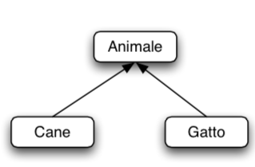
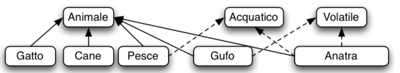

Mauro Bogliaccino

# Corso Java

## Programma del corso Java SE - Java SE 11 Programmer I

* [Java SE 11 Programmer I](https://education.oracle.com/java/java-se/product_267)

---

## obiettivi

* Accedere e creare campi e metodi statici
* Scrivere codice Java che utilizza variabili, array, costrutti condizionali e loop per raggiungere gli obiettivi del programma
* Incapsulare una classe usando modificatori di accesso e overload dei costruttori
* Manipolare i dati numerici, di testo e di stringa utilizzare gli operatori Java appropriati
* Impostare le variabili di ambiente per consentire al compilatore Java e agli eseguibili di runtime di funzionare correttamente
* Creare semplici classi Java e utilizzare riferimenti a oggetti per accedere a campi e metodi in una classe

---

## obiettivi II

* Dimostrare polimorfismo implementando un'interfaccia Java
* Gestire un'eccezione controllata in un'applicazione Java
* Utilizzare un'espressione Predicato Lambda come argomento di un metodo
* Definire e implementare una semplice gerarchia di classi che supporti i requisiti dell'applicazione
* Identificare i principi di programmazione modulari

---

## Che cos'è un programma Java

* Caratteristiche principali del linguaggio Java
* Tecnologia Java e ambiente di sviluppo
* Esecuzione e test di un programma Java

---

##  Comprensione della tecnologia e dell'ambiente Java

* Descrivere la tecnologia Java e l'ambiente di sviluppo Java
* Identificare le funzionalità chiave del linguaggio Java
* struttura del **JDK**
* Java: le basi del linguaggio
* Introduzione linguaggio Java
* Introduzione a Java e al processo di compilazione
* Compilazione ed esecuzione

---

## Creare una classe main Java

* Classi Java
* Il metodo main
* Aggiunta di un metodo main
* Crea un programma Java eseguibile con una classe main
* Compilare ed eseguire un programma Java dalla riga di comando
* Creare e importare pacchetti
* Primo approccio al codice
* metodo main e metodi ausiliari
* Primi programmi Java.

---

## Input/Output  

* Input/Output utente
* Input da console, java.util.Scanner
* Output con oggetto System.out

---

## Lavorare con i dati

* Presentazione delle variabili
* Lavorare con le stringhe
* Lavorare con i numeri
* Manipolazione dei dati numerici

---

## **Identificatori e tipi di dato**

* Schema Libero
* Case sensitive
* Commenti
* Regole per gli identificatori

---

## Le variabili in java

* Dichiarazione di una variabile:
* Variabili d'istanza
* Variabili locali
* Scope delle variabili
* Parametri formali
* Argomenti passati al metodo main
* Package introduzione
* Consultazione Oracle API docs

---

## **Tipi di dato primitivi**

* Tipi di dati interi, casting e promotion
* Tipi di dati a virgola mobile, casting e promotion
* Tipo di dato logico - booleano
* Tipo di dato primitivo letterale

---

## Gestire più elementi

* Lavorare con le condizioni
* Utilizzo delle istruzioni IF
* Lavorare con un elenco di elementi
* Elaborazione di un elenco di elementi

---

## Introduzione alla libreria standard

* Il comando import
* La classe String
* La documentazione della libreria standard di Java
* Cicli finiti, infiniti, annidati

---

## Descrivere oggetti e classi

* Lavorare con oggetti e classi
* Definizione di campi e metodi
* Dichiarazione, istanziazione e inizializzazione di oggetti
* Lavorare con i riferimenti agli oggetti
* Lavorare con le matrici
* Dichiarare e creare istanze di oggetti Java e spiegare i cicli di vita degli oggetti (inclusa la creazione, la dereferenziazione mediante riassegnazione e la garbage collection)
* Definire la struttura di una classe Java

---

## Tipi complessi

* struttura delle classi,
* progettazione delle classi in UML,
* stato interno,
* metodi costruttori, overloading

---

## I metodi costruttori

* Caratteristiche di un costruttore
* Costruttore di default
* Package e visibilità
  
---

## Creare e utilizzare i metodi

* Utilizzare metodi
* Argomenti del metodo e valori restituiti
* Metodi e variabili statici
* Come vengono passati gli argomenti a un metodo
* Overload di un metodo

---

## Utilizzare l'incapsulamento

* Controllo di accesso
* Incapsulamento
  * metodi getter e setter
* Overload di Costruttori

---

## Strutture condizionali

* Operatori relazionali e condizionali
* Altri modi per usare i costrutti IF / ELSE
* Utilizzo delle istruzioni switch
* Utilizzo del debugger

---

## Utilizzo di operatori e costrutti decisionali

* Utilizzare gli operatori Java incluso l'uso della parentesi per sovrascrivere la precedenza dell'operatore
* Utilizzare le istruzioni di controllo Java incluso if, else e switch
* Crea e usa
  * do...while,
  * while,
  * for
  * foreach,
  * loop nidificati,
  * istruzioni break e continue

---

## Array e loop

* Lavorare con le date
* Analisi dell'array args
* Matrici bidimensionali
* Costrutti di loop alternativi
* nidificazione di Loop  
* La classe ArrayList

---

## Lavorare con gli Array in Java

* Gli array in Java
  * Dichiarazione
  * Creazione
  * Inizializzazione
* Dichiarare, istanziare, inizializzare e utilizzare un array **monodimensionale**
* Dichiarare, creare un'istanza, inizializzare e utilizzare un array **bidimensionale**
* Limiti degli array in JAVA: **dimensione prefissata**
* **Copia** di array
* Array e ArrayList.

---

## La Programmazione ad oggetti

* Progettazione di **nuove** classi e metodi.
* Oggetti, variabili, riferimenti
* Classi, metodi e variabili di istanza
* Istanziare un oggetto: il metodo costruttore
* Variabili d'istanza e incapsulamento
* Visibilità dei membri di una classe

---

## La Programmazione ad oggetti II

* La parola riservata null
* Determinazione delle classi
* Coesione, dipendenza, programmazione per contratto, parametro implicito, effetti collateral
* Membri statici e membri dinamici
* Modificatori d'accesso e visibilità: public, private, friendly, static
* Classi e metodi con parametri

---

## Lavorare con tipi di dati primitivi Java e API String

* Dichiarare e inizializzare le variabili (casting e promotion di tipi primitivi)
* Identificare l'ambito della variabile
* Usa l'inferenza del tipo di variabile locale
* Crea e manipola stringhe
* Manipola i dati usando la classe StringBuilder e i suoi metodi

---

## Lavorare con tipi di dati primitivi Java e API String II

* Caso particolare: la classe String e i principali metodi.
* Classe Object
  * Metodi equals, toString e clone.
* Classi wrapper per i tipi di dati primitivi
* La classe Random: generazione di numeri pseudo-random.
* La classe Timer: schedulare un'azione, che verrà eseguita ogni tot millisecondi.

---

## Manipolare e formattare i dati nel programma

* Utilizzare la classe String
* Utilizzo dei documenti dell'API Java
* Uso della classe StringBuilder
* Ulteriori informazioni sui tipi di dati primitivi
* Più operatori numerici
* promotion e casting delle variabili

---

## La classe Math

* La classe Math e i principali metodi.
* uso di una classe con metodi statici
* accedere a proprietà e metodi senza istanziare nuovi oggetti

---

## Classi istanziabili

* tipo di utilizzo classe
  * creo oggetto,
  * attraverso l'oggetto, con l'opertore dot (.) accedo ai suoi metodi e variabili
* relazioni tra classi: uso, aggregazione, teoria delle classi

---

## aggregazione

---

## **Ereditarietà in Java**

* Panoramica
* Lavorare con sottoclassi e superclassi
* Metodi prioritari nella superclasse
* Creazione ed estensione di classi astratte

* Teoria:
  * Class design: diversi ruoli degli oggetti/attori del progetto
  * diverse classi con differenti relazioni tra esse
  * @override toString() (solo in caso di extends)

---

## Ereditarietà

* Riutilizzo del codice.
* Strutture ereditarie
* La parola riservata super
* Modificatori d'accesso: package, private e protected
* Impedire l'ereditarietà: la parola riservata final

---

## Riutilizzo delle implementazioni tramite ereditarietà

* Creare e utilizzare sottoclassi e superclassi
* Creare ed estendere le classi astratte
* Abilitare il polimorfismo con metodi prioritari
* Utilizzare il polimorfismo per lanciare e chiamare metodi, differenziando il tipo di oggetto rispetto al tipo di riferimento
* Distinguere tra overload, override e information hiding

---

## Utilizzare le interfacce

* Polimorfismo
* Polimorfismo nelle classi di fondazione JDK
* Utilizzo delle interfacce
* Inferenza di tipo variabile locale
* Utilizzare l'interfaccia List
* Presentazione delle espressioni Lambda

---

## Programmazione astratta attraverso le interfacce

* Creare e implementare interfacce
* Distingua l'ereditarietà delle classi dall'ereditarietà dell'interfaccia comprese le classi astratte
* Dichiarare e utilizzare le istanze List e ArrayList
* Comprensione dell'espressione lambda
* [interfacce](015_interfacce.md)

---

## Gestione delle eccezioni e asserzioni

* Eccezioni
* Gestione degli errori
* Asserzioni
* Panoramica
* Propagazione di eccezioni
* Catturare e lanciare eccezioni
* Gestione di più eccezioni ed errori
* Descrivere i vantaggi della gestione delle eccezioni e differenziare tra eccezioni verificate, non selezionate ed errori

---

## Gestire le eccezioni II

* Creare blocchi try-catch e determinare in che modo le eccezioni alterano il flusso del programma
* Crea e invoca un metodo che genera un'eccezione
* **Java è robusto e sicuro, al limite si 'pianta' il programma**
* usare la gestione eccezioni di JAVA
* gestione delle eccezioni
* blocco try-catch-finally
* le parole chiave throws e throw
* [eccezioni](017_eccezioni.md)

---

## JShell

* Codice di test
* Nozioni di base di JShell
* JShell in un IDE