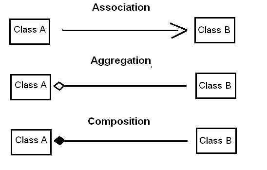

# Associazione

* L'associazione è uno dei concetti fondamentali dell'OOP.
* L'associazione definisce la relazione tra due classi indipendenti l'una dall'altra.
* L'associazione non ha proprietario.
* L'associazione può essere uno a uno, uno a molti, molti a uno e molti a molti.

L'associazione è uno dei concetti fondamentali dell'OOP. 

L'obiettivo dell'associazione è definire la **relazione tra due classi indipendenti** l'una dall'altra ed è anche indicata come relazione di molteplicità tra oggetti. 

---

## L'associazione non ha proprietario

Non c'è nessun titolare dell'associazione. 

Gli oggetti coinvolti in un'associazione possono usarsi l'un l'altro (associazione bidirezionale), oppure uno solo usa l'altro (associazione unidirezionale), ma hanno una loro durata di vita. 

L'associazione può essere unidirezionale/bidirezionale, uno-a-uno, uno-a-molti, molti-a-uno e molti-a-molti.

---

## Rappresentazione UML

