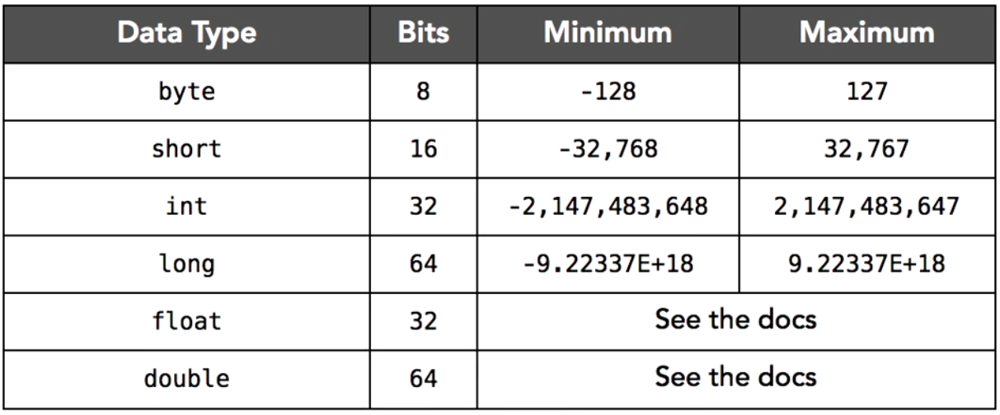

# Tipi di dato primitivi




## Tipo primitivo

### In un linguaggio ad oggetti puro i dati dovrebbero essere definiti sotto forma di oggetti

### Per efficienza
* Java definisce dati primitivi
* La dichiarazione di una istanza (variabile) alloca spazio
* Un valore è associato direttamente alla variabile 
* (e.g, i == 0) 

### Ne vengono definiti dimensioni e codifica

### Rappresentazione indipendente dalla piattaforma

## Tipi primitivi
* boolean
* char
* byte
* short
* int
* long
* float
* double


* void


###  I tipi numerici, i char e le stringhe seguono la sintassi C

*  Esempi
123 (int)
256789L (L o l = long)
0567 (ottale) 0xff34 (hex)
123.75 0.12375e+3 (float o double)
'a' '%' '\n'
'\123' (\ introduce codice ASCII)
"1" "prova\n"

### Tipo boolean
* Esempi
true
false


### In un mondo OO ideale, vi sono solo
classi e istanze di classi

### Java
* Per efficenza usa tipi primitivi per int,
float etc.
* Per completezza
  * Definisce anche classi per interi, float etc.
(classi wrapper)
  * Definisce operazioni per passare dai dati
primitivi alle classi wrapper
Classi "Wrapper" per tipi Primitivi

### Se si vogliono trattare anche i dati
primitivi come oggetti si possono
utilizzare le classi "wrapper"

### Un oggetto di una classe "wrapper"
incorpora un dato primitivo e fornisce
metodi per operare su di esso

### Le classi wrapper dei tipi primitivi sono
definite nel package java.lang
9
### Corrispondenza
Tipo Primitivo
boolean
char
byte
short
int
long
float
double
void
ClasseWrapper
Boolean
Character
Byte
Short
Integer
Long
Float
Double
Void


### Primitive Variables

Variables that store value.


Java defines few types like int (numbers), float(floating point numbers), char (characters). Variables of these types store the value of the variable directly. These are not objects. These are called primitive variables. 

An example is shown below: Primitive Variables contains bits representing the value of the variable.

```
int value = 5;

```
Different primitive types in java are char, boolean, byte, short, int, long, double, or float. Because of these primitive types, Java is NOT considered to be a pure objected oriented language.

Numeric Data Types
- Types  : byte, short, int, long, float, double
- Number of bits : 8, 16, 32, 64, 32, 64
- Range  : -x to x-1 where x = Power(2, number of bits -1)

char Data Type
- Used to store characters. Size of character is 16 bits.

Examples

```
int i = 15;
long longValue = 1000000000000l;
byte b = (byte)254;

float f = 26.012f;
double d = 123.567;
boolean isDone = true;
boolean isGood = false;
char ch = 'a';
char ch2 = ';';
```

```java

public class Application {

	public static void main(String[] args) {//here we learn about primitive types of variables!
		int myNumber;//initialize variable that is an integer
		myNumber = 100;//assign variable
		System.out.println(myNumber);//print variable's value
		short myShort = 851;//for shorter numbers
		System.out.println(myShort);
		long myLong = 34093;//for longer numbers
		System.out.println(myLong);
		double myDouble = 3.14159732;//for extra precision
		System.out.println(myDouble);
		float myFloat = 324.4f;//point variables
		System.out.println(myFloat);
		char myChar = 'y';//single characters with single quotes unlike strings!
		System.out.println(myChar);
		boolean myBoolean = true;//booleans
		System.out.println(myBoolean);
		byte myByte = 127;//only 8 bits of data
		System.out.println(myByte);
	}

}
```

[Everything you'll ever need to work with Java primitive types!](https://github.com/deletescape/Primitives)