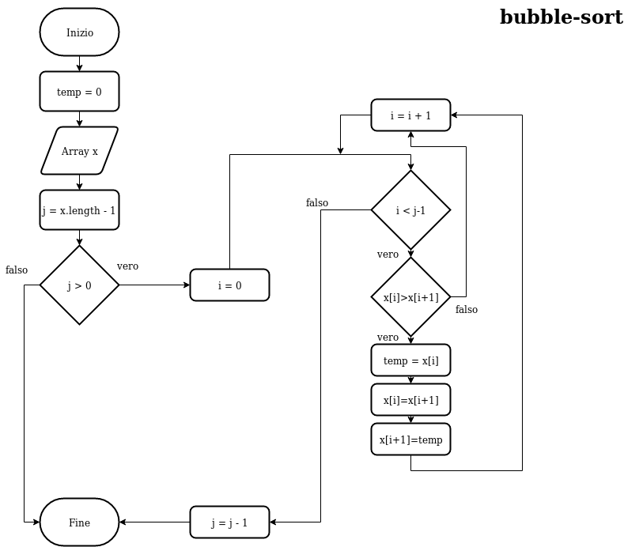
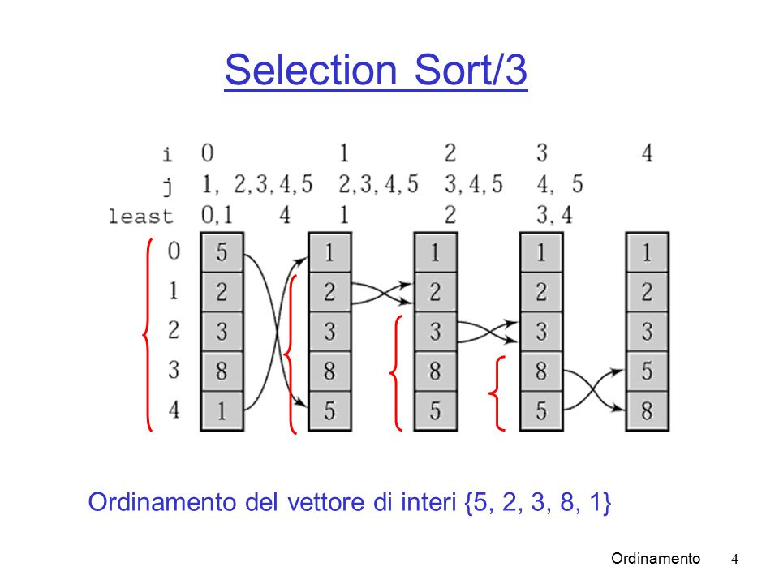

# Algoritmi di ordinamento in Java

## Bubble-sort




```java
    public void bubbleSort(int[] array) {

        for(int i = 0; i < array.length; i++) {
            boolean flag = false;
            for(int j = 0; j < array.length-1; j++) {

                //Se l' elemento j è maggiore del successivo allora
                //scambiamo i valori
                if(array[j]>array[j+1]) {
                    int k = array[j];
                    array[j] = array[j+1];
                    array[j+1] = k;
                    flag=true; //Lo setto a true per indicare che é avvenuto uno scambio
                }
                

            }

            if(!flag) break; //Se flag=false allora vuol dire che nell'ultima iterazione
                             //non ci sono stati scambi, quindi il metodo può terminare
                             //poiché l' array risulta ordinato
        }
    }

```

## Selection-sort



```java
    public void selectionSort(int[] array) {

        for(int i = 0; i < array.length-1; i++) {
            int minimo = i; //Partiamo dall' i-esimo elemento
            for(int j = i+1; j < array.length; j++) {

            
            //ogni volta che nell' iterazione troviamo un elemento piú piccolo di minimo facciamo puntare minimo all' elemento trovato
                    if(array[minimo]>array[j]) {
                        minimo = j;
                    }
            }

            //Se minimo e diverso dall' elemento di partenza
            //allora avviene lo scambio
            if(minimo!=i) { 
                int k = array[minimo];
                array[minimo]= array[i];
                array[i] = k;
            }
        }
    }

```