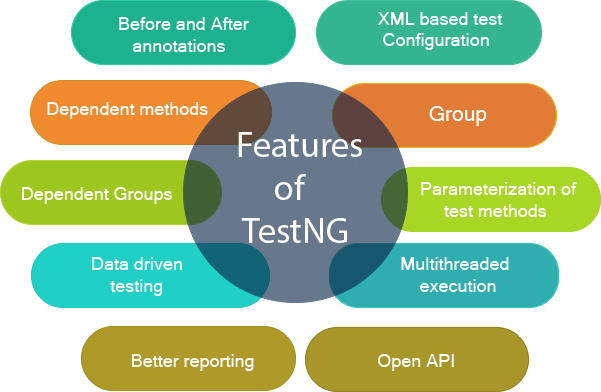

# TestNG

---



---

TestNG (Test Next Generation) è un framework di testing per Java che offre molte caratteristiche avanzate rispetto a JUnit. Di seguito sono elencate alcune delle caratteristiche principali di TestNG e le differenze chiave rispetto a JUnit:

### Caratteristiche Principali di TestNG

---

1. **Supporto per Test Multithread:**
   - TestNG offre il supporto integrato per l'esecuzione di test in parallelo su thread multipli. Puoi specificare il numero di thread tramite annotazioni o configurazioni XML.

---

2. **Gruppi di Test:**
   - Puoi raggruppare i test in categorie o gruppi usando l'annotazione `@Test(groups="nomeGruppo")`. Questo consente di eseguire solo specifici gruppi di test quando necessario.

---

3. **Parametrizzazione dei Test:**
   - Puoi eseguire lo stesso test con dati di input diversi utilizzando l'annotazione `@Parameters` o leggendo da un file XML o da un dataprovider.

---

4. **Dipendenze Tra i Test:**
   - Puoi specificare le dipendenze tra i test, in modo che un test venga eseguito solo se i test dai quali dipende sono stati eseguiti con successo.

---

5. **DataProvider:**
   - TestNG supporta un approccio avanzato alla gestione dei dati attraverso i `DataProvider`, che consente di inviare dati ai tuoi test da metodi diversi.

---

6. **Suite di Test:**
   - Puoi organizzare i tuoi test in una suite, consentendo l'esecuzione di più test insieme e la configurazione di suite-level.

---

7. **Report Dettagliati:**
   - TestNG fornisce report di esecuzione dettagliati, inclusi grafici e informazioni sul tempo di esecuzione, rendendo più facile l'analisi dei risultati dei test.

---

8. **Supporto per la Configurazione XML:**
   - Puoi configurare TestNG attraverso file XML per personalizzare l'esecuzione dei test, inclusi parametri, inclusione ed esclusione di classi o metodi, ecc.

---

9. **Listener di Test:**
   - Puoi utilizzare listener per eseguire azioni personalizzate prima o dopo l'esecuzione dei test, suite o metodi.

---

10. **Ripetizione dei Test:**
    - TestNG consente di specificare il numero di volte che un test deve essere ripetuto utilizzando l'annotazione `@Test(invocationCount = n)`.

### Differenze Chiave tra TestNG e JUnit

---

1. **Metodi di Test Pubblici:**
   - In JUnit, i metodi di test devono essere dichiarati come pubblici (`public`), mentre in TestNG possono anche essere dichiarati come privati (`private`).

---

2. **Suite di Test:**
   - TestNG supporta nativamente la definizione di suite di test attraverso file XML, mentre in JUnit l'esecuzione dei test su larga scala può richiedere l'uso di strumenti esterni.

---

3. **Configurazione XML:**
   - TestNG utilizza ampiamente la configurazione XML per personalizzare l'esecuzione dei test, mentre JUnit si basa principalmente su annotazioni.

---

4. **Struttura del Framework:**
   - TestNG è progettato per supportare più approcci e paradigmi di testing, offrendo un framework più flessibile rispetto a JUnit.

---

5. **Ripetizione dei Test:**
   - TestNG fornisce un modo nativo per ripetere i test con l'annotazione `@Test(invocationCount = n)`, mentre in JUnit è necessario utilizzare l'estensione `@Rule` o la classe `Parameterized` per ottenere risultati simili.

In generale, TestNG è spesso preferito in scenari più complessi o avanzati di automazione dei test, mentre JUnit è più comune in contesti più semplici o quando si segue una struttura di test più tradizionale. Tuttavia, la scelta tra i due dipende dai requisiti specifici del progetto e dalle preferenze del team di sviluppo.

---

## TestNG in Eclipse

TestNG è un framework di testing per Java che semplifica l'esecuzione di test unitari, integrazione e di sistema. Può essere integrato facilmente con Eclipse per la creazione, l'esecuzione e la gestione dei test. Ecco una guida passo-passo su come utilizzare TestNG in Eclipse:

### Passi per utilizzare TestNG in Eclipse

---

#### 1. Installa il Plugin TestNG in Eclipse

- Apri Eclipse.
- Vai su "Help" -> "Eclipse Marketplace".
- Cerca "TestNG" nella barra di ricerca.
- Installa il plugin TestNG e segui le istruzioni per completare l'installazione.

---

#### 2. Crea un nuovo progetto Java

- Vai su "File" -> "New" -> "Java Project".
- Assegna un nome al tuo progetto e clicca su "Finish".

---

#### 3. Aggiungi le librerie TestNG al tuo progetto

- Fai clic destro sul tuo progetto in Eclipse.
- Seleziona "Build Path" -> "Configure Build Path".
- Nella scheda "Libraries", fai clic su "Add Library".
- Seleziona "TestNG" e clicca su "Next" e "Finish".

---

#### 4. Crea una classe di test con TestNG

- Fai clic destro sulla tua cartella "src" nel progetto.
- Vai su "New" -> "Class".
- Assegna un nome alla tua classe di test, ad esempio, "MyTestClass".
- Seleziona l'opzione "public static void main(String[] args)" e clicca su "Finish".

---

#### 5. Aggiungi annotazioni TestNG alla tua classe di test

- Utilizza le annotazioni TestNG come `@Test`, `@BeforeClass`, `@AfterClass`, ecc.
- Esempio:

     ```java
     import org.testng.annotations.Test;

     public class MyTestClass {

         @Test
         public void myTestMethod() {
             // Il tuo test logic qui
             System.out.println("Test eseguito con successo!");
         }
     }
     ```

---

#### 6. Configura il file TestNG XML

- Crea un file XML di configurazione TestNG per definire la suite di test, i gruppi, i listener, ecc.
- Esempio di file `testng.xml`:

     ```xml
     <!DOCTYPE suite SYSTEM "http://testng.org/testng-1.0.dtd">
     <suite name="MyTestSuite">
         <test name="MyTest">
             <classes>
                 <class name="package.MyTestClass" />
             </classes>
         </test>
     </suite>
     ```

---

#### 7. Esegui i test

- Fai clic destro sul file `testng.xml`.
- Seleziona "Run As" -> "TestNG Suite".

---

#### 8. Visualizza i risultati

- Dopo l'esecuzione, potrai visualizzare i risultati dei tuoi test nella finestra "TestNG Results" in Eclipse.

Questi sono i passi di base per iniziare con TestNG in Eclipse. Puoi esplorare ulteriori funzionalità e opzioni offerte da TestNG per adattare il framework alle tue esigenze specifiche di testing.
