# JavaFX

## Observable  e ObservableList

Implementiamo 2 metodi
* sumNonOsservabile()
* sumOsservabile()
* eseguiamo prima l'uno e poi l'altro
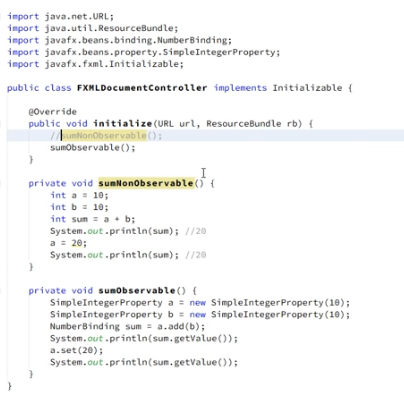
* creiamo una proprietà di tipo SimpleStringProperty
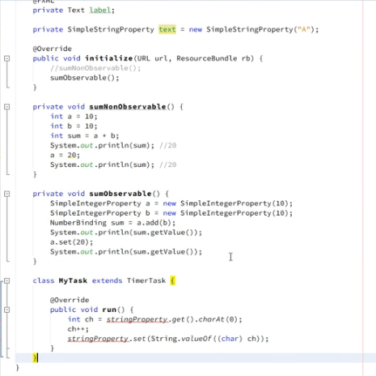
* creiamo un task
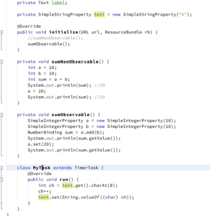
* attiviamo iltask settando un intervallo di un secondo
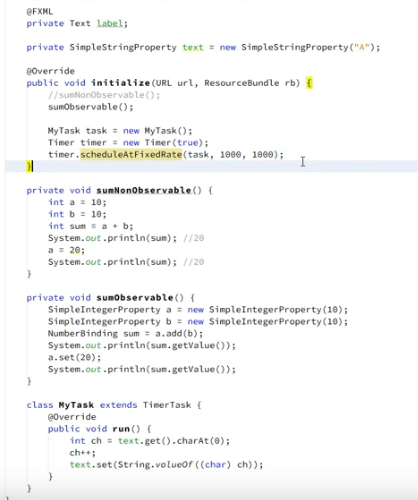
* aggiungiamo due textfiel con id tf1 e tf2 annotate nel controller
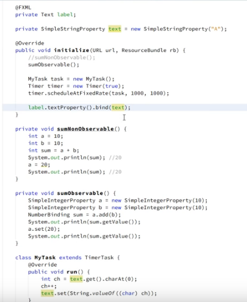
* tf1 e tf2 annotate nel controller
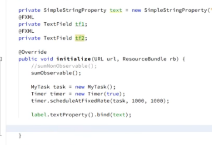
* colleghiamo unidirezionale
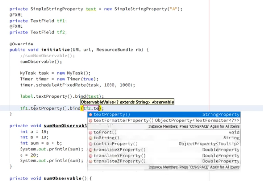
* colleghiamo bidirezionale
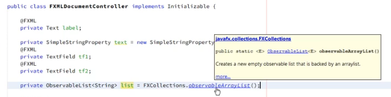
* ...
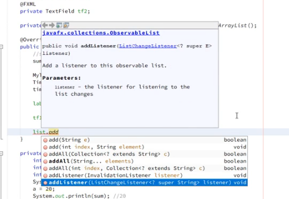
* ..
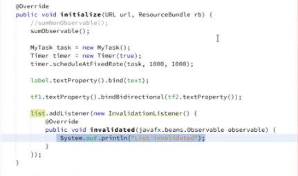
* ...
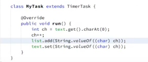
* ...
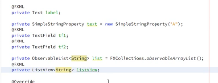
* ...
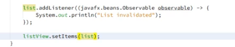
* ...
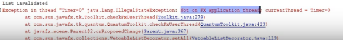
* ...
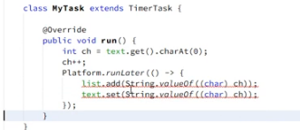
* ..
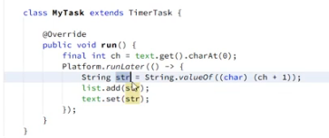
