# Streams 

## programmazione funzionale
Gli stream portano  in Java la programmazione funzionale
### vantaggi
* un codice più efficiente
* uso delle espressioni Lambda
* uso semplificato dei thread attraverso i `ParallelStreams`
* uno stream pipeline consiste in una sorgente, seguita da zero o più operazioni intermedie ed una unica operazione terminale

## sorgente Stream
* Gli steam possono essere creati a partire da Collections, Lists, Set, int, long, double, array, righe di un file
* le operazioni sugli stream possono essere intermedie o terminali
  * *intermedie* come filter, map o sort, ritornano  uno stream: possiamo così concatenarle per raffinare i risultati
  * *terminali* come forEach, collect, o reduce: *queste non ritornano uno stream*!

## Operazioni intermedie
* Sono permesse zero o più operazioni intermedie
* L'rodine delle operazioni è importante, specialmente per dataset di grandi dimensioni: prima applica i filtri, quindi ordina o rimappa
* se i dataseto sono di grandissime dimensioni, puoi usare  `ParallelStreams`
* le operazioni intermedie:
  * anyMatch
  * distinct
  * filter
  * findFirst
  * flatmap
  * map
  * skip
  * sorted

## Operazioni terminali
è permessa una sola operazione terminale.
* `forEach` applica la stessa operazione  su ciascun elemento
* `collect` salva gli elementi in una nuova collezione
* altre opzioni riducono lo stream ad un singolo elemento sommario
* `count()`, `max()`, `min()`, `reduce()`, `summaryStatistics()`
## Intstream
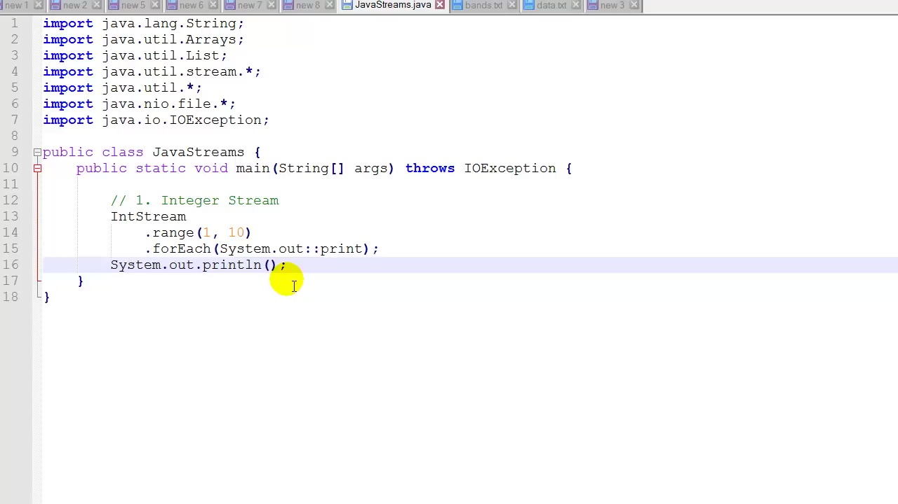
## skip
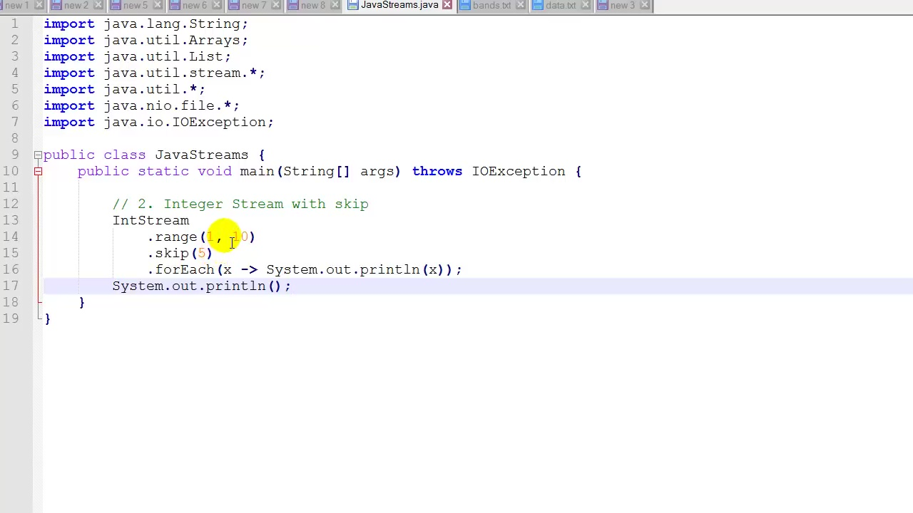
## findfirst
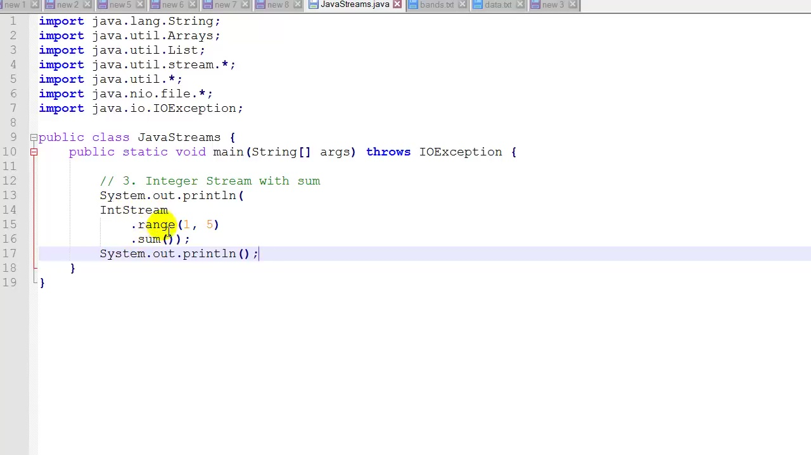
## sorted
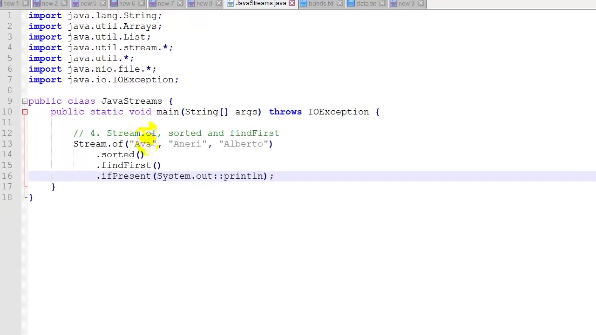
## array
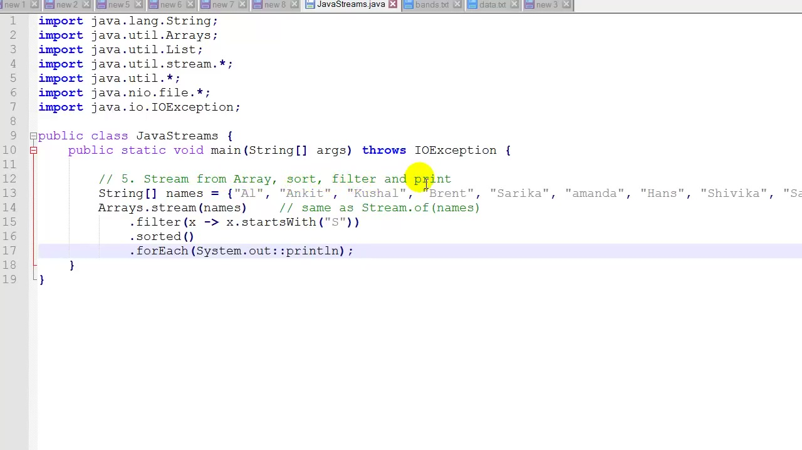
## average
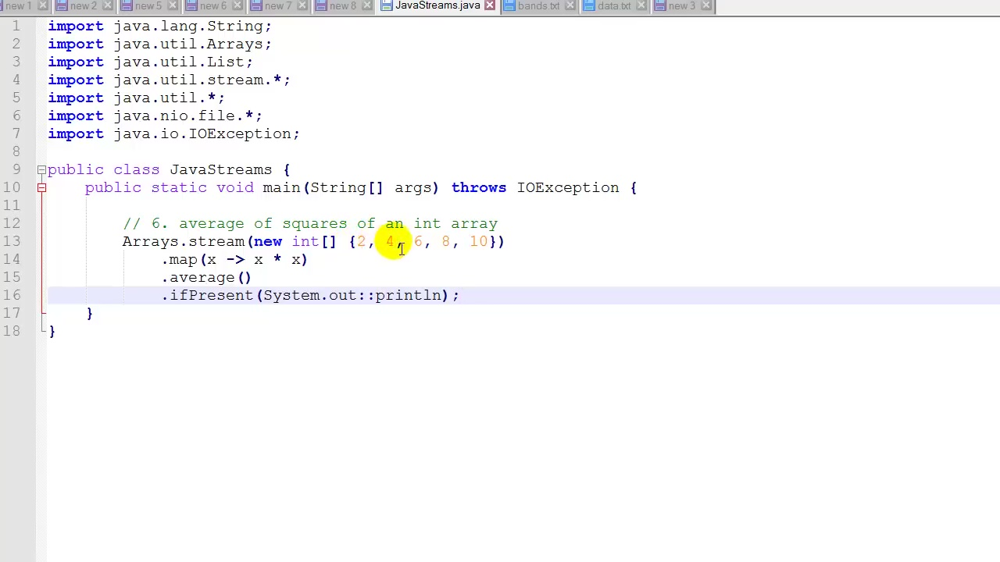
## List
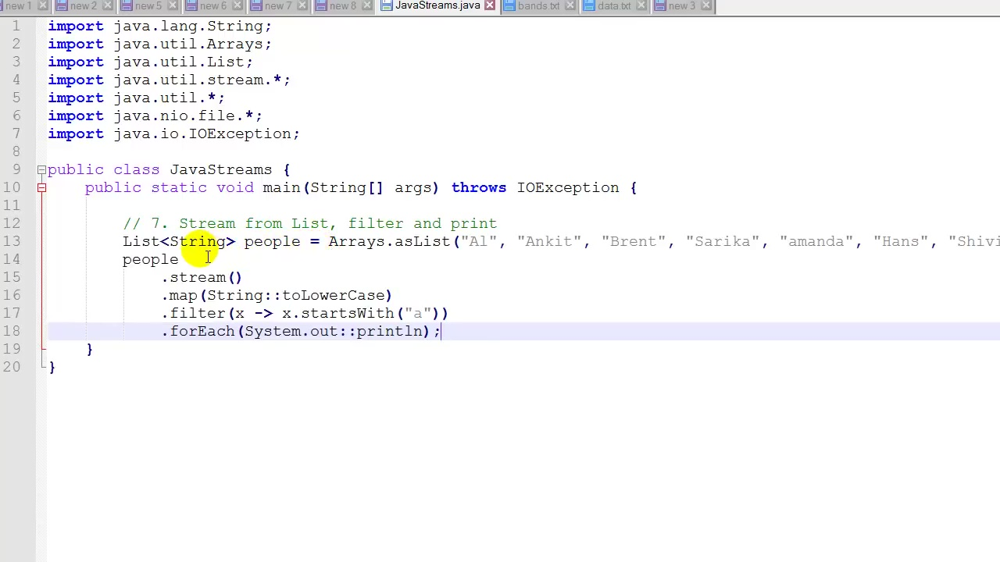
## text file
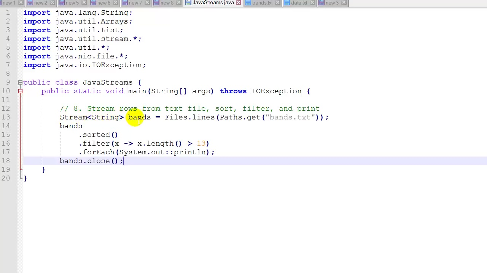

## collect
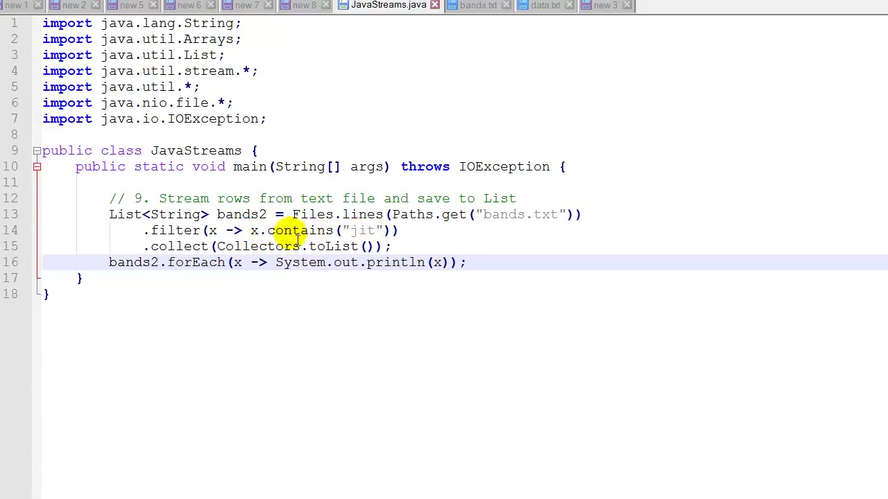
## file e count
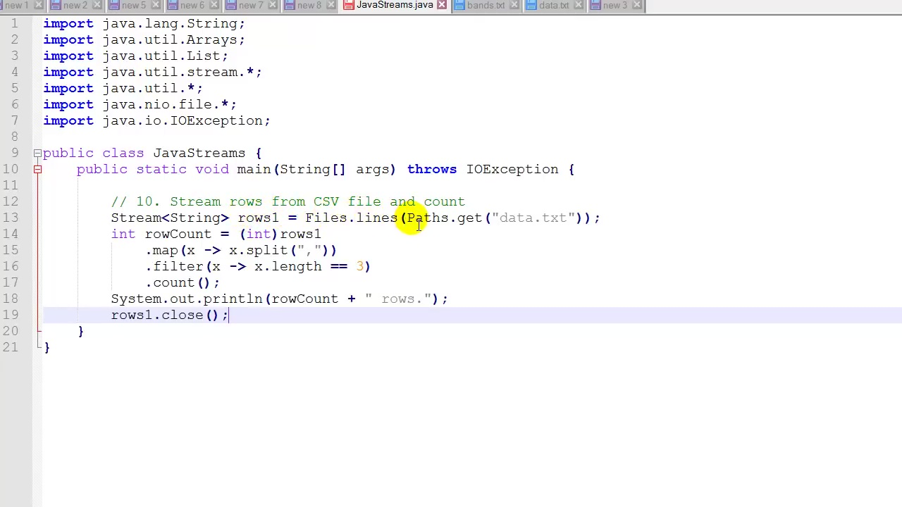
## split e foreach
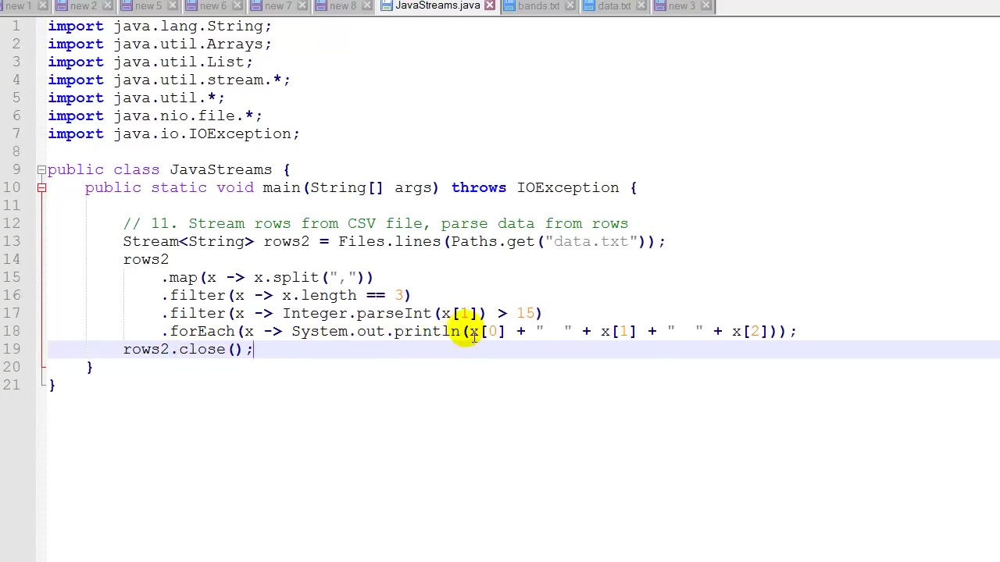
## rimappa su hashmap
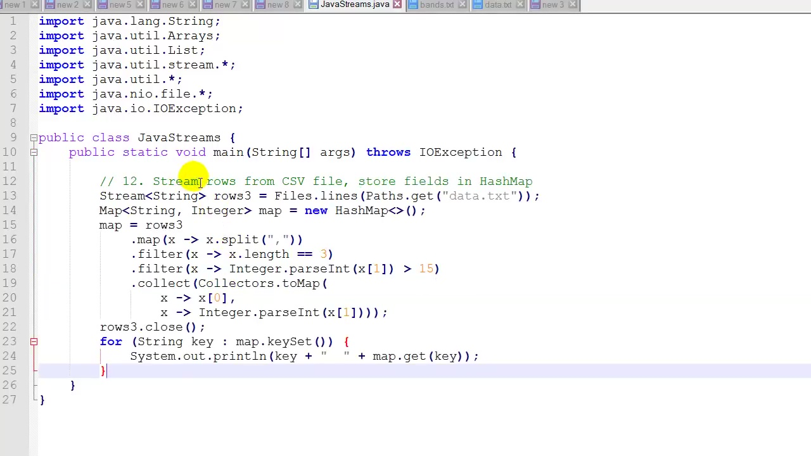
## reduce
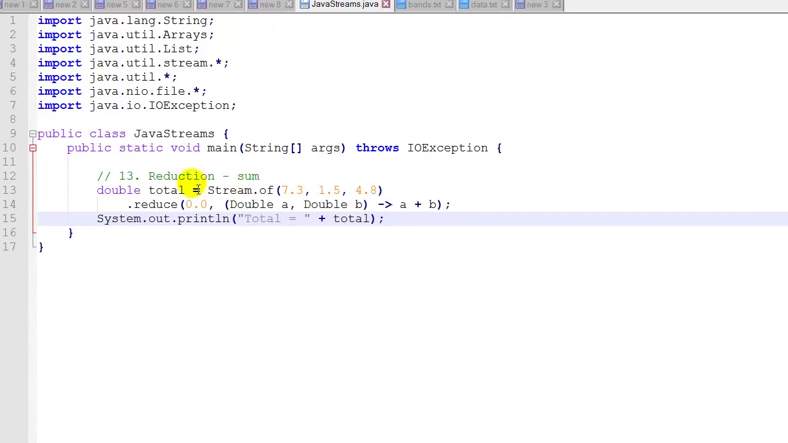
## summaryStatistics
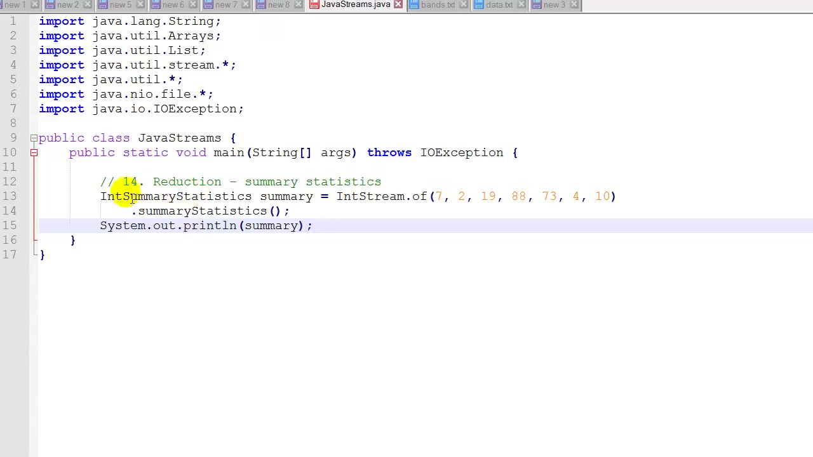
