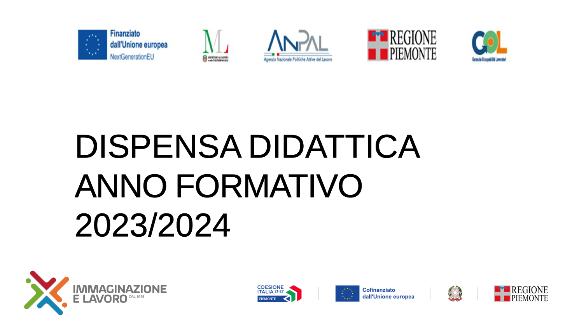

---

Il corso è strutturato in modo da coprire i concetti di base del linguaggio Java, insieme a esercizi pratici per rafforzare la comprensione. Ogni sezione è pensata per durare dalle 3 alle 5 ore.

---

## **Corso Java per Principianti - 70 ore**

### **Modulo 1: Introduzione a Java e Ambiente di Sviluppo (5 ore)**
- **1.1 Introduzione al linguaggio Java**  
  - Che cos’è Java e le sue caratteristiche principali
  - Java Virtual Machine (JVM), JDK e JRE
  - Installazione di Java e di un IDE (Eclipse, IntelliJ IDEA, o NetBeans)
- **1.2 Struttura di un programma Java**  
  - Panoramica su classi, metodi e package
  - Il primo programma: "Hello World!"
- **1.3 Compilazione ed esecuzione di un programma Java**
  - Compilazione dal terminale e dall'IDE
  - Processo di compilazione ed esecuzione
- **1.4 Esercitazione Pratica**
  - Scrivere e compilare semplici programmi di esempio

### **Modulo 2: Fondamenti di Programmazione (7 ore)**
- **2.1 Tipi di Dati e Variabili**  
  - Tipi primitivi: int, double, char, boolean
  - Dichiarazione, assegnazione e inizializzazione di variabili
  - Costanti (parola chiave `final`)
- **2.2 Operatori**  
  - Operatori aritmetici, relazionali e logici
  - Operatori di incremento/decremento
- **2.3 Input/Output**  
  - Utilizzo della classe `Scanner` per l'input da tastiera
  - Stampa di output sulla console (`System.out.println`)
- **2.4 Esercitazione Pratica**  
  - Scrittura di un semplice calcolatore

### **Modulo 3: Controllo di Flusso (8 ore)**
- **3.1 Strutture Condizionali**  
  - Costrutti `if`, `else`, `else if`
  - Operatore ternario
- **3.2 Strutture Iterative**  
  - Cicli `while`, `do-while` e `for`
  - Uso di `break` e `continue`
- **3.3 Switch Case**  
  - Sintassi e utilizzo del costrutto `switch`
- **3.4 Esercitazione Pratica**  
  - Esempi pratici di condizioni e cicli, come il calcolo del fattoriale e numeri primi

### **Modulo 4: Array e Stringhe (7 ore)**
- **4.1 Introduzione agli Array**  
  - Dichiarazione e inizializzazione di array
  - Ciclo `for` per iterare sugli array
  - Array multidimensionali
- **4.2 Le Stringhe in Java**  
  - Metodi principali della classe `String`
  - Concatenazione e manipolazione delle stringhe
- **4.3 ArrayList (Collezioni)**
  - Introduzione alla classe `ArrayList`
  - Differenze tra array e ArrayList
- **4.4 Esercitazione Pratica**  
  - Lavorare con array e stringhe, ordinare numeri o parole

### **Modulo 5: Programmazione Orientata agli Oggetti (OOP) - Parte 1 (10 ore)**
- **5.1 Concetti di Base di OOP**  
  - Introduzione a classi e oggetti
  - Metodi e costruttori
  - Il concetto di incapsulamento
- **5.2 Attributi e Metodi**  
  - Modificatori di accesso (`public`, `private`, `protected`)
  - `this` e `static`
- **5.3 Costruttori e Overloading dei Metodi**
  - Costruttori personalizzati
  - Overloading dei metodi
- **5.4 Esercitazione Pratica**  
  - Creazione di una classe con attributi e metodi, creazione di oggetti

### **Modulo 6: Programmazione Orientata agli Oggetti (OOP) - Parte 2 (10 ore)**
- **6.1 Ereditarietà**  
  - Concetto di ereditarietà
  - Parola chiave `super`
  - Override dei metodi
- **6.2 Polimorfismo**  
  - Metodi sovraccaricati
  - Polimorfismo in Java
- **6.3 Classi astratte e interfacce**
  - Definizione di classi astratte
  - Implementazione di interfacce
- **6.4 Esercitazione Pratica**  
  - Creazione di un sistema con classi derivate e polimorfismo

### **Modulo 7: Eccezioni e Gestione degli Errori (6 ore)**
- **7.1 Gestione delle Eccezioni in Java**  
  - Concetto di eccezioni
  - Blocchi `try`, `catch`, `finally`
  - Eccezioni personalizzate
- **7.2 Eccezioni Controllate e Non Controllate**  
  - Differenza tra checked e unchecked exceptions
  - Lancio di eccezioni con `throw`
- **7.3 Esercitazione Pratica**  
  - Gestione degli errori in un programma con input non validi

### **Modulo 8: Collezioni e Generics (7 ore)**
- **8.1 Collezioni in Java**  
  - Introduzione alle collezioni: List, Set, Map
  - Differenza tra collezioni e array
- **8.2 Iterazione sulle Collezioni**  
  - Utilizzo di `Iterator` e `for-each`
  - Ordinamento e ricerca in collezioni
- **8.3 Generics**  
  - Introduzione ai tipi generici
  - Creazione di classi e metodi generici
- **8.4 Esercitazione Pratica**  
  - Manipolazione di una lista di oggetti e utilizzo di collezioni avanzate

### **Modulo 9: File e Input/Output (5 ore)**
- **9.1 Lettura e Scrittura su File**  
  - Classe `File` e `FileWriter`
  - Lettura di file con `BufferedReader`
- **9.2 Serializzazione degli Oggetti**
  - Serializzazione e deserializzazione degli oggetti
- **9.3 Esercitazione Pratica**  
  - Creazione di un programma per leggere e scrivere dati su file

### **Modulo 10: Progetto Finale (5 ore)**
- **10.1 Pianificazione del Progetto**  
  - Scelta di un progetto finale (gestione biblioteca, sistema di prenotazione, ecc.)
  - Creazione di diagrammi UML per la struttura del progetto
- **10.2 Sviluppo del Progetto**  
  - Implementazione delle funzionalità principali del progetto
- **10.3 Revisione e Ottimizzazione**
  - Revisione del codice e refactoring per migliorare le performance
- **10.4 Presentazione del Progetto**
  - Presentazione del progetto finale al gruppo o all’insegnante

---

### **Conclusione e Certificazione (1 ora)**
- Riepilogo degli argomenti principali trattati
- Test finale per valutare le competenze acquisite
- Consegna del certificato di partecipazione
